**NeuroTrader Lab — learning, evolution va instrument yaratishni birlashtiruvchi yakuniy loyiha rejasi**

```yaml
blueprint_version: 1.1
authority: implementation_source
status: active
supersedes:
  - previous conceptual proposals
implementation_order: P0 -> P1 -> P2 -> P3 -> P4 -> P5
```

Bu hujjat laboratoriya uchun yagona arxitektura manbasi. Har bir implementation commit yoki PR unda qaysi package, invariant va acceptance criterion bajarilayotganini ko‘rsatadi. Paketlar parallel boshlanmaydi: keyingi package faqat oldingisining engineering acceptance mezonlari bajarilgach ochiladi. Bu qoida economic edge yoki authority avtomatik paydo bo‘lishini anglatmaydi.

2026-09-07. Holat: active implementation blueprint. P0–P5 uchun xavfsiz, research-only dasturiy contractlar va regression testlar qo‘shilgan. Bu engineering coverage real P2 pilot, confirmed transfer, novel instrument yoki Council/paper iqtisodiy natijasi yuz berdi degani emas: ular o‘z evidence gate’larigacha yopiq qoladi. Bu hujjat amaldagi promotion qoidalarini almashtirmaydi.

2026-09-07 yakuniy Edge receipt holati: `source_generation_id=268`dagi explicit, besh-armli compiled cohortning barcha immutable replaylari terminal `edge_not_found` bilan yopildi. `trading:reconcile-edge-experiment-receipts XAUUSD --timeframe=H1 --apply` shu terminal evidence uchun bitta versioned `INCONCLUSIVE` receipt yozdi; u replay, authority, watermark yoki live/paper ruxsat yaratmaydi. `source_generation_id=267` esa consumed-parameter attestationi to‘liq emasligi sabab legacy quarantine/recovery yo‘lida qoladi.

Maqsad: XAUUSD bo‘yicha tajriba o‘tkazadigan, executable ko‘nikma yaratadigan, uni boshqa agentga muvaffaqiyatli ko‘chiradigan, yangi strategiya/taktika/risk/management instrumentlarini sintez qiladigan va tekshirilgan specialistlardan Champion Council tuzadigan AI laboratoriya.

Asosiy qaror: mavjud Laravel boshqaruvi va Python replay engine saqlanadi. Learning, Academy, Foundry va evolution bitta tekshiriladigan experiment contract orqali ulanadi. Dastlab bitta ko‘nikmaning to‘liq hayot sikli ishlatiladi; keyin shu mexanizm yangi instrumentlar va Council uchun kengaytiriladi. Foyda topilishi tadqiqot natijasi; ishlaydigan laboratoriyaning texnik qabul mezoni foydali natijani ham, rad etish va dalil yetishmasligini ham to‘g‘ri qayd etishdir.

**Tekshirilgan boshlang‘ich holat**

Quyidagi qiymatlar XAUUSD/H1 monitoring buyruqlaridan olindi va 2026-09-07, taxminan 09:41 Asia/Tashkent vaqtida qayta tekshirildi. Ular bir atomik DB snapshot emas; buyruqlar ketayotgan paytda tizim ishlashda davom etishi mumkin. H1 laboratoriya ownership’i bilan M5 execution timeframe bir tushuncha emas.

| Ko‘rsatkich | Kuzatilgan qiymat | Talqin |
| --- | ---: | --- |
| Academy passports / retained beams | 47 / 121 | Ro‘yxat va saqlangan variantlar mavjud |
| Academy deepest stage / planned trials | 0 / 0 | Mastery va rejalash konversiyasi ochilmagan; `planned=0` barcha tarixiy triallar sonini bildirmaydi |
| Full-stack passports / master candidates | 195 / 0 | Passport mavjudligi mastery isboti emas |
| Edge-bearing compositions / positive powered folds | 0 / 0 | Hozirgi Edge monitorida economic edge qayd etilmagan |
| Canonical provisional / confirmed skills | 81 / 0 | Provisional bilim confirmed executable skillga aylanmagan |
| Learning-kernel confirmed lessons | 10 | Yuqoridagi confirmed skilldan boshqa hisob birligi |
| Learning settlement lag | 54 | In-flight, actionable va legacy qismlarga ajratish kerak |
| Skill mentors / eligible parent models | 0 / bo‘sh ro‘yxat | Transferdan naslchilik vakolatiga o‘tish isbotlanmagan |
| Gene interactions / unresolved Council disagreements | 0 / 22 | Interaction qidiruvi va disagreement tajribalariga ehtiyoj bor |
| Learning active dispatches / queued replay jobs | 0 / 0 | Faqat learning lane holati; butun runtime bo‘sh degani emas |
| Architecture repair | `SOURCE_EDGE_COHORT_NOT_COMPLETELY_SETTLED` | `source_generation_id=267`, 1 passport, 5 trial |

Oldingi matn source 267’ni G185 deb ataydi. Ushbu audit source ID va blokerni qayta tekshirdi; generation label va uning barcha arm holatlarini alohida DB audit bilan tasdiqlamadi. G185 uchun oldindan tayyorlangan recovery’ni ko‘r-ko‘rona bajarish kerak emas.

Monitorning `transplant_success_rate=0.5` qiymati ham confirmed mentor isboti emas: hozirgi query butun jadvaldagi passed/failed triallardan hisoblaydi, symbol/timeframe bilan cheklanmagan va denominatorni ko‘rsatmaydi. `provisional_skill_birth_rate_percent=218.92` esa 81 lessonni 37 paired rowga bo‘lishdan chiqqan. Buni conversion ehtimoli deb ko‘rsatish noto‘g‘ri. UI’da har foiz bilan scope, davr, numerator, denominator va unique subject turi bo‘lsin.

Read-only tekshiruvlar:

```powershell
php artisan trading:edge-formation-academy XAUUSD --timeframe=H1 --json
php artisan trading:edge-genesis-status XAUUSD --timeframe=H1 --json
php artisan trading:monitor-learning-lane XAUUSD --timeframe=H1 --json
```

`trading:causal-progress-governor --json` bu auditda ishlatilmadi: uning command’i oddiy chaqiriqda ham `allocate(..., true)` orqali allocation yozadi. `--json` read-only degani emas.

**Koddan topilgan asosiy muammolar va mavjud poydevor**

| Joy | Tekshirilgan holat | Kerakli o‘zgarish |
| --- | --- | --- |
| [Stage Director](../../backend-laravel/app/Services/CausalStageMasteryDirectorService.php), [Autonomous Director](../../backend-laravel/app/Services/AutonomousLearningProgressDirectorService.php) | Near-confirmable hisobida `confidence >= .5`; dispatch tanlovida 2 positive, 0 negative, exact intervention va boshqa cheklovlar | Ranking signali bilan dispatch eligibility alohida nomlansin; eligibility yagona versiyalangan qoidaga o‘tsin |
| [Governor](../../backend-laravel/app/Services/CausalProgressRatchetGovernorService.php), Autonomous Director | Allocation bor, lekin Director ishni statik branch tartibida tanlaydi; quality synthesis ayrim debt tekshiruvlaridan oldin turadi | Barcha qimmat materializer uchun umumiy admission va durable work tanlovi |
| Governor `debt()` | Bir `settlement_lag` qiymati `unsettled_terminal_trials` va `settlement_lag` nomlari bilan yig‘indiga ikki marta qo‘shiladi | Qarz unique bajariladigan ishlar bo‘yicha hisoblanadi; ataylab weight bo‘lsa, weight aniq nomlanadi |
| Autonomous Director `advanceLocked()` | Active-agent check reconciliation’dan oldin return qiladi | Replay quvvati bandligi terminal evidence settlementini bloklamasin; materialization va settlement resurslari ajratilsin |
| [Academy](../../backend-laravel/app/Services/XauusdEdgeFormationAcademyService.php) | Passport, beam, planner, settlement mavjud; real agent/cohort dispatch adapteri yo‘q | Yangi mustaqil replay engine emas, mavjud Foundry’ga Academy materializer adapteri |
| Academy `plan()` | Birinchi/oxirgi arm roli indeks bilan belgilanadi; takroriy `updateOrInsert` settled trialni yana `planned` qilishi mumkin | Explicit arm roles; immutable plan + alohida attempts; terminal holatni retry bilan qayta ochmaslik |
| Academy va [Python schema](../../ai-service-python/app/services/parameter_schema.py) | Academy’dagi 4 token to‘g‘ridan-to‘g‘ri runtime enum emas | Control markerlarini bajariladigan parametrdan ajratish; producer–consumer contract |
| [Edge Foundry](../../backend-laravel/app/Services/DependencyAwareEdgeGenesisFoundryService.php) | `materialize()` arm parametrlarini hisoblaydi, ammo agentga `parameter_diff=[]` yozadi | Compiled intervention, control identity va parentless provenance’ni birga attest qilish |
| Stage Director `assess()` | Ta’sir aggregate count farqiga, upstream preservation count tengligiga bog‘langan | Event/decision trace orqali ownership; soni teng, lekin hodisalari boshqa natijalarni ajratish |
| [Interaction Lab](../../backend-laravel/app/Services/GeneInteractionLabService.php) | `independently_confirmed` maplargina qidiruvga kiradi | Chegaralangan research interaction yo‘li; authority talablari alohida qoladi |
| [Statistical validation](../../ai-service-python/app/services/statistical_validation.py) | DSR denominatorida excess kurtosis bevosita ishlatiladi | Asl formula bilan matematik moslik va mustaqil reference test |

Loyihada allaqachon [Canonical Learning Outbox](../../backend-laravel/app/Services/CanonicalLearningOutboxService.php), [Skill Cartridge](../../backend-laravel/app/Services/CanonicalSkillCartridgeService.php), [Authority Foundry](../../backend-laravel/app/Services/EvolutionaryAuthorityFoundryService.php), settlement watermark, legacy debt firewall, scaffold ratchet va Python DSR/PBO mavjud. Ularni qaytadan parallel qurish kerak emas. Yangi contract ushbu mexanizmlarning handofflarini boshqaradi. Global trial ledgerning to‘liqligi bu auditda isbotlanmadi; mavjud portfolio trial metadata ham hisobga olinishi kerak.

**Birinchi navbatda baholashning o‘zini to‘g‘rilash**

DSR uchun maqoladagi denominator kvadrati raw kurtosis `K` bilan:

```text
1 - skewness * SR + ((K - 1) / 4) * SR²

excess = K - 3 bo‘lsa:
1 - skewness * SR + ((excess + 2) / 4) * SR²
```

Hozir kod `(excess / 4) * SR²` ishlatyapti. `_excess_kurtosis()` haqiqatan raw momentdan 3 ayiradi. Bir xil Sharpe benchmark saqlangan sun’iy nazorat misolida hozirgi probability `0.951901`, yuqoridagi formula bilan `0.946156` chiqdi. Bu real savdo natijasi emas; formula farqi 95% chegarasidagi qarorni o‘zgartira olishini ko‘rsatuvchi reproducible fixture. Manba: [Bailey–López de Prado, DSR, Equation 2](https://www.davidhbailey.com/dhbpapers/deflated-sharpe.pdf).

Fixture: Python `random.Random(17)`, 60 ta `gauss(0,1)+0.55`, trial Sharpe qiymatlari `[-0.1, 0.0, 0.1, 0.2]`. Reference hisobda raw standardized fourth moment ishlatiladi; amaldagi `_expected_max_sharpe()` benchmarki saqlanadi. Bu tekshiruv DSR’ning qolgan barcha qismlari to‘g‘riligini tasdiqlamaydi. Sampling, trial korrelatsiyasi va per-trade returnlar ham alohida tekshiriladi. Tuzatilgan baholar yangi evaluator versiyasi bilan yoziladi; eski evidence jimgina rewrite qilinmaydi.

Enum taqqoslashda aniqlangan tokenlar:

| Academy maydoni | Python schema qabul qilmaydigan tokenlar |
| --- | --- |
| `confirmation_family_policy` | `reaction_plus_participation`, `confirmation_blinded_control` |
| `trigger_topology_policy` | `frozen_current`, `state_adaptive` |

`frozen_current` — control baseline qiymatini olish haqidagi planner operatori bo‘lishi mumkin. `confirmation_blinded_control` — experiment arm roli. Ularni Python enumiga shunchaki qo‘shish semantik muammoni hal qilmaydi. Compiler birinchisini exact baseline qiymatiga, ikkinchisini mavjud, attest qilingan ablation mexanizmiga aylantiradi. `state_adaptive` esa qaysi session/volatility siyosatini anglatishini explicit belgilashi kerak; jim defaultga o‘tish taqiqlanadi.

**Yagona arxitektura: har tajriba qaror va keyingi ish bilan yopiladi**

```mermaid
flowchart TD
    A[Real pre-2026 archive va challenge] --> B[Academy: keyingi o‘rganiladigan vazifa]
    B --> C[Versioned experiment contract va compiler]
    C --> D[Probe va paired replay]
    D --> E[Settlement: evidence va claim assessment]
    E --> K[Conversion rules va immutable receipt]
    K --> W[Durable work ledger]
    W --> G[Governor: budget va priority]
    G --> X[Director: mavjud executorlarni chaqiradi]
    X --> D
    K --> S[Executable skill va evidence graph]
    S --> T[Transplant va descendant sinovlari]
    T --> K
    S --> F[Instrument sintezi va library compression]
    F --> C
    S --> L[Specialist archive va Council evaluation]
    L --> P[Mustaqil validation va prospective paper]
```



Conversion Kernel faqat state ma’nosi, o‘tish sharti va qaror receipt’iga egalik qiladi. Academy vazifa tanlaydi; Governor quvvat ajratadi; Director bajaradi; Python hisoblaydi. Kernel ulkan yangi scheduler yoki replay engine bo‘lmasin. Mavjud `LearningKernelService` episode/learning ownership’i bilan yangi conversion policy chegarasi aniq yozilsin.

Har yakunlangan experiment uchun invariant:

```text
terminal experiment
  -> immutable evidence reference
  -> versioned conversion receipt
  -> final classification
  -> next durable work item OR explicit terminal/deferred reason
```

Bu invariant har tajriba foydali bilim berishini kafolatlamaydi. `INCONCLUSIVE`, `UNDERPOWERED`, `UNREACHABLE`, `TECHNICAL_QUARANTINE`, `BUDGET_EXHAUSTED` halol javoblar. Ilmiy noaniqlikni majburan causal rejectionga aylantirish mumkin emas.

**Bitta juda uzun status zanjiri o‘rniga ajratilgan holatlar**

Oldingi taklifdagi `PATH_SCAFFOLD → ECONOMIC_EDGE → ... → E4` majburiy chiziq juda qattiq. Har foydali instrument scaffold bo‘lishi shart emas; bir komponent bir contextda ishlashi, boshqasida ishlamasligi mumkin.

| O‘lchov | Misollar |
| --- | --- |
| Work lifecycle | planned, ready, leased, running, settling, settled, quarantined |
| Evidence | valid, incomplete, invalid, selection_contaminated |
| Behavior claim | untested, unreachable, no_effect_on_probe, stage_controllable |
| Economic claim | underpowered, harmful, inconclusive, positive_candidate, independently_replicated |
| Reuse authority | research_only, confirmed_component, mentor, descendant_proven, eligible_parent |
| Deployment eligibility | blocked, E3_candidate, paper_observing, E4_eligible |
| Freshness | active, drift_suspected, hibernating, revoked |

Readiness bularning versiyalangan hosilasi. Governor uchun taxminiy ranking bilan real dispatch permission bir field bo‘lmasin. Dashboard, scheduler va Director aynan bir eligibility evaluation’ni ko‘rsatsin. O‘tish grafigi amaldagi parent/paper gate’lariga adapter orqali ulanadi; bu hujjat gate’larni yumshatmaydi.

**Experiment contract, receipt va ishonchli bajarish**

Bitta canonical paket quyidagilarni bog‘laydi:

```yaml
contract_version: research_experiment_v1
scope:
  symbol: XAUUSD
  laboratory_timeframe: H1
  execution_timeframe: M5
claim:
  target_stage: confirmation
  hypothesis: explicit_testable_statement
  minimum_meaningful_effect: preregistered
identity:
  baseline_epoch_hash: required
  data_and_mtf_hash: required
  runtime_and_contract_hash: required
  intervention_hash: required
  window_plan_hash: required
  evaluator_version: required
arms: explicit_control_candidate_ablation_roles
budget: discovery_limit_and_conditional_proof_reserve
stopping_rule: preregistered
next_actions: conditional_dependencies
```

PHP va Python bitta versioned schema registry va canonical serialization’dan foydalansin. Hash scope’ga context, temporal binding, code/execution versiyasi, data vintage va kerak bo‘lsa seed ham kiradi. Hash stable contract’dan olinadi; generation auto-ID yoki attempt raqami tajriba identity’sini o‘zgartirmaydi. Bir logical intervention bir necha compiled fieldni o‘zgartirsa, compiler bu mappingni oldindan declare qiladi; `single_gene`ni ko‘r-ko‘rona `count(diff)==1` bilan tenglashtirmaslik kerak.

Control baseline’dan exact nusxa bo‘ladi. Treatment actual consumed parameter diff bilan attest qilinadi. Memory-blinded yoki negative control uchun role-specific farq tekshiriladi; bunday armlarda bir xil trading parametrlari ataylab bo‘lishi mumkin. Causal baseline bilan genetic parent alohida reference bo‘lib qoladi.

Receipt yozish, subject revisionni o‘zgartirish, keyingi work item va dispatch outbox yozish bitta DB transaction ichida bajariladi. Queue xabari keyin yetkaziladi. Consumer idempotent, work identity unique, lease’da timeout/heartbeat va fencing token bo‘ladi. Kech qolgan eski worker yangi attempt’ni settle qila olmaydi. Shu transaction/outbox prinsipi DB commit bo‘lib, queue xabari yo‘qoladigan bo‘shliqni yopadi; duplicate delivery esa consumer tomonidan yutiladi. [AWS transactional outbox qo‘llanmasi](https://docs.aws.amazon.com/prescriptive-guidance/latest/cloud-design-patterns/transactional-outbox.html).

Maqsad: at-least-once delivery sharoitida natijaning idempotent qo‘llanishi. Faqat SHA256 qo‘shish bilan distributed exactly-once execution hosil bo‘lmaydi. Mavjud canonical outbox mos joyda kengaytiriladi; boshqa domain uchun alohida outbox zarur bo‘lsa, uning ownership chegarasi hujjatlashtiriladi.

Readiness proof ichida `subject_revision`, `evidence_revision`, `rule_version`, epoch, blockers va hash bo‘ladi. Dispatch va settlement vaqtida joriy holat transaction ichida qayta tekshiriladi. Eski hash o‘zicha hali ham ruxsat borligini kafolatlamaydi.

**Governor: isbotlash qarzini yopish va qidiruvni davom ettirish**

Priority: lease recovery → terminal settlement → tayyor confirmation/ablation → Academy repair → bounded interaction → yangi exploration. Hard data/execution xatosi tegishli scope’ni to‘xtatadi. Settlement uchun barcha active replaylar tugashini kutish shart emas.

Qarz `unsettled_row_count`dan emas, unique actionable work va uning yoshi/xarajatidan hisoblanadi. Legacy irrecoverable yoki in-flight evidence butun labni cheksiz bloklamaydi. Retry limiti, quarantine owneri va aniq qayta urinish sharti bo‘ladi.

Evidence escrow saqlanadi: yangi discovery kelajakdagi ehtimoliy proof xarajatini hisobga oladi. Lekin har candidate uchun darhol barcha 3/9-fold ishlarini runnable qilish kerak emas. Keyingi ishlar dependency bilan blocked turadi; salbiy/underpowered natijada rezerv qayta ajratiladi. Foizlar boshlang‘ich config, dalil emas. Hisob replay wall/CPU time, quvvat va navbat kechikishi bo‘yicha yuradi.

Positive edge yuqori priority oladi, ammo bitta fluke sabab butun lab cheksiz confirmationga qulflanmaydi. Confirmationning xarajat/urinish limiti bor; mustaqil exploration va adversarial tekshiruv uchun minimum ulush saqlanadi. Emitter reward faqat settled natijadan olinadi; authority gain bilan birga halol uncertainty resolution ham hisoblanadi.

**Academy: eng zaif bosqichdan real tajribagacha**

Academy materializerining birinchi to‘liq yo‘li:

```text
terminal evidence
  -> bottleneck diagnosis
  -> exact frozen baseline
  -> legal Academy plan
  -> schema va consumption preflight
  -> existing Foundry cohort
  -> paired replay
  -> stage/economic settlement
  -> receipt va next work
```

Oracle mavjud bo‘lmasa ham real funnel diagnostikasi ishlasin. Opportunity yo‘q bo‘lsa context/location curriculum; setup bor, confirmation yo‘q bo‘lsa confirmation curriculum; entry bor, realized outcome zaif bo‘lsa management attribution. Kam event downstream skillni rad qilishga asos bo‘lmaydi.

Upstream freeze exact stage attribution uchun foydali. Ammo stage erishilgani abadiy saqlanadigan ishlash kafolati emas. Har yangi epoch eski ko‘nikmalar uchun regression challenge’dan o‘tadi; drift mavjud trustni pasaytirishi mumkin. Tarixiy achievement saqlanadi, joriy eligibility esa qayta baholanadi.

Risk/management mutatsiyasini actual dependency asosida ochish kerak. Masalan invalidation masofasi entry R:R admissioniga ham ta’sir qilishi mumkin. “Trade yo‘q, demak barcha stop parametrlar ta’sirsiz” degan umumiy qoida noto‘g‘ri. Hard risk ceiling doim tashqi governance’da; agent ruxsat etilgan chegaralar ichidagi risk usullarini keyin alohida sinaydi.

**Probe va event taqqoslashni kuchaytirish**

Probe qarorlari: parametr runtime’da consume qilinmadi → contract xatosi; target stage reachable emas → upstream repair; reachable bo‘lib, shu probe’da farq yo‘q → `NO_EFFECT_ON_PROBE`; target stage qarorlari farq qildi → paired replay. Axis retirement faqat oldindan belgilangan coverage, sensitivity diapazoni va epoch doirasida qilinadi.

Hyperband’dan bosqichma-bosqich quvvat ajratish g‘oyasi olinadi. Qisqa sample’dagi P&L yoki no-op butun tarix uchun yakuniy hukm bo‘lmaydi. [Hyperband original paper](https://www.jmlr.org/papers/v18/16-558.html).

Event matching key’i treatment o‘zgartirishi mumkin bo‘lgan predicted direction, context label yoki setup identity’dan tuzilmasin. Asosiy anchor: immutable data snapshot, symbol, qaror vaqti, execution calendar va kerak bo‘lsa treatmentdan mustaqil detector versiyasi. Direction ikkala arm uchun oldindan enumerable bo‘lmasa outcome sifatida qoladi.

Confirmation experimentida upstream baseline setup kohortini oldindan muzlatish mumkin. Upstream topology o‘zgarsa common raw market timeline va ikkala armning to‘liq exposure’i taqqoslanadi. Faqat ikkala arm trade qilgan hodisalarni olish selection bias yaratadi. Shared, candidate-only, control-only va WAIT hodisalari alohida ko‘rsatiladi.

Stage conversion bilan birga sifat, false-entry, cost, tail risk va opportunity flood kuzatiladi. `100 setup → 22 confirmation` o‘zi mastery emas. Economic taqqoslash common capital/time horizon bo‘yicha net returnlarni ham ko‘rsatadi; har armning o‘z trade ro‘yxatidagi o‘rtacha P&L yetarli emas. Causal xulosa replay modeli va tekshirilgan intervention doirasi bilan chegaralanadi.

**Scaffold, interaction va isbotlangan skill**

Path scaffold saqlanadi: u foyda bermasa ham keyingi bosqichni reachable qilishi mumkin. Keyingi trialda scaffold frozen, target intervention alohida, removal ablation mavjud bo‘ladi. Scaffold hech qachon avtomatik trading authority olmaydi.

Research interaction uchun `control`, `A`, `B`, `A+B` bir xil preregistered oynalarda sinovdan o‘tadi. Additive outcome scale’da interaction kontrasti `Y(A+B)-Y(A)-Y(B)+Y(control)`; uning uncertainty’si va out-of-sample takrori kerak. Main effect bilan interactionni ajratish factorial designning maqsadi. [NIST factorial effects](https://itl.nist.gov/div898/handbook/pri/section6/pri615.htm).

A va B har biri alohida profitable bo‘lishi synergy izlash uchun shart emas. Agar qiymat faqat birga paydo bo‘lsa, claim va ablation butun `A+B` moduliga tegishli bo‘ladi; A va B alohida economic skill deb ko‘rsatilmaydi. Amaldagi authority gate’lari bu research natijasidan avtomatik chetlab o‘tilmaydi.

Skill Cartridge quyidagilarni olib yuradi: executable program/parameter patch; preconditions; produces/consumes capabilities; expiry/invalidation; frozen dependencies; effect vector va uncertainty; negative/underpowered evidence; contraindications; costs; replication va ablation receipts; successful/failed transfer contexts; trust epoch. Oddiy confidence soni o‘rniga sample hajmi, effect interval va scope ko‘rsatiladi.

Transfer zanjiri: compatible host baseline → host+skill va host control → mustaqil sinov → removal → oldingi hostdagi regressiya → mentor evaluation → research descendant → amaldagi parent gate. Tadqiqot uchun descendant yaratish genetic parent authority berish bilan teng emas; bootstrap deadlock bo‘lmasligi kerak.

**Eng muhim qo‘shimcha: learning foyda berayotganini ham tajriba bilan isbotlash**

Loyihaning markaziy maqsadi uchun alohida compounding benchmark kerak. Xuddi bir xil yangi, ajratilgan pre-2026 challenge’larda va teng compute limitida ikkita research jarayoni taqqoslanadi:

```text
A: eski tasdiqlangan skills, memory va transferdan foydalanadi
B: shu instrument/engine, lekin memory va inheritance ko‘r qilinadi
```

Oldindan belgilangan metrikalar: meaningful stage gain uchun ketgan compute; mustaqil tasdiqlangan skill yield; takroriy xato; transferdan keyingi incremental effect; eski challenge regressiyasi. Challenge set, success mezoni va compute accounting oldindan muhrlanadi. Bir vaqtda bir nechta search komponentini almashtirib, hamma yutuqni memoryga berish mumkin emas.

A muntazam va uncertainty hisobga olinganda B’dan yaxshiroq bo‘lsa, learning/evolution foydasi o‘lchangan bo‘ladi. A yaxshiroq chiqmasa, xotira hajmini oshirish o‘rniga retrieval, application yoki transfer yo‘li qayta tekshiriladi. Bu taklif ushbu loyiha uchun engineering mezoni; tayyor bozordagi edge kafolati emas.

**Yangi instrument yaratish: kichik typed til va o‘sadigan kutubxona**

Avval mavjud Strategy/Tactic/Toolbox compilerlari capability graph bilan ulanadi. Keyin kichik typed DSL qo‘shiladi: price/ATR/duration/bool turlari, closed-candle operatorlari, sequence/window/expiry, available-at va invalidation. `SEQUENCE`, `WITHIN`, `CONFIRMED_BY` kabi operatorlar avval mavjud runtime primitive’lariga compile qilinadi.

LLM hypothesis yoki DSL AST taklif qiladi; o‘zi authority bermaydi. Deterministic compiler schema, type, dependency va complexity budgetni tekshiradi. Static temporal tekshiruv runtime prefix-invariance bilan mustahkamlanadi: kelajak candlelar o‘zgarsa ham oldingi qaror o‘zgarmasligi kerak. Swingning markaziy candle vaqti uning tasdiqlanish vaqti emas; revised/external data uchun ham real `available_at` talab qilinadi.

Instrument sikli: synthesize → compile → reachable behavior → paired marginal value → independent replication → ablation → boshqa compatible hostga transfer → reusable primitive. Takror ishlagan AST qismlari libraryga yig‘iladi; compressiondan keyingi program semantik regression va replay’dan qayta o‘tadi. Shu yo‘l DreamCoder’ning program sintezi va qayta ishlatiladigan abstraction o‘rganish g‘oyasidan ilhomlanadi; moliyaviy natija bu maqolada isbotlanmagan. [DreamCoder](https://arxiv.org/abs/2006.08381).

Yangilik mezoni: yangi nom yoki parametr emas, mavjud kutubxonaga nisbatan yangi behavior, o‘lchangan incremental value va transfer. “Hech qayerda yo‘q” yoki barcha rejimda “ideal”ligini isbotlash o‘rniga local XAUUSD scope’dagi foyda, xarajat va cheklovlar isbotlanadi. Risk usullari ham shu sikldan o‘tadi, lekin tashqi hard risk governorni o‘zgartira olmaydi.

**Challenge archive, specialistlar va Council**

Challenge’lar real pre-2026 oynalardan olinadi: failure stage, regime, session, cost stress va avvalgi regressiyalar. Boshlanishida oz sonli meaningful cell ishlatiladi; sakkiz o‘lchamning to‘liq Cartesian mahsuloti sparse, tasodifiy specialistlar ko‘paytirishi mumkin. Curriculum learning progress va uncertainty bo‘yicha vazifa tanlaydi; teacher tanlagan oynalar yakuniy mustaqil baholash vazifasini bajarmaydi.

QD archive’da eng yaxshi economic specialist, research scaffold va informativ failure alohida saqlanadi. Cell occupancy bilan birga sample support, overlap va reproducibility ko‘rsatiladi. MAP-Elites turli behavior niche’laridagi yechimlarni saqlash uchun asos beradi; ushbu bozordagi ustunligi alohida tekshiriladi. [MAP-Elites](https://arxiv.org/abs/1504.04909).

Council faqat isbotlangan memberlar va tekshirilgan combined behavior bilan ochiladi. Router eligibility, context va kalibrlangan uncertainty asosida specialist tanlaydi. Markaziy risk/execution veto va WAIT mavjud bo‘ladi. Council qiymati eng yaxshi yakka specialistga nisbatan combined replay, xarajat, korrelatsiyalangan failure va member-removal ablation bilan o‘lchanadi. Memberlar borligi Council foydali degani emas.

Disagreementlar yangi research case bo‘ladi, lekin hindsight oracle orqali runtime signal yoki sealed paper tuningi yaratilmaydi. Drift tarixiy evidence’ni o‘chirmaydi: trust epoch yopiladi, qayta tekshiruv va zarur containment ishlaydi. Dastlab oddiy audit qilinadigan drift qoidalari yetarli; POET, DIAYN, successor features yoki katta scientist rollari minimal loop uchun prerequisite emas.

**Overfitting va paper vaqt chegarasi**

Har hypothesis, topology, AST, parameter variant, emitter policy va selection qarori trial ledgerga kiradi. Global urinishlar tarixi hamda bir xil aligned evaluation matrix’da taqqoslash mumkin bo‘lgan cohort alohida tushunchalar: PBO uchun mos kelmaydigan natijalarni shunchaki bitta jadvalga aralashtirish mumkin emas. PBO model selectionning backtestda haddan tashqari moslashish xavfini baholaydi; barcha research xatolarini avtomatik bartaraf qilmaydi. [PBO original paper](https://www.davidhbailey.com/dhbpapers/backtest-prob.pdf).

2/3/9-fold bosqichlari compute va replication protokoli sifatida saqlanadi. To‘qqiz fold sonining o‘zi mastery emas: disclosure/selection history, label overlap, purge/embargo, effective sample, effect uncertainty, realistic costs va mustaqil assessment tekshiriladi. Discovery oynasi qayta baholansa, u yangi mustaqil tasdiq deb sanalmaydi. Formal power event count threshold bilan tenglashtirilmaydi.

2005–2025 research. 2026 paper-only cheklovi saqlanadi. Hozir 2026 yilning bir qismi allaqachon o‘tgan: keyin yaratilgan model bilan yanvar tarixini replay qilish prospective paper emas. Haqiqiy forward evidence candidate va policy muhrlangan vaqtdan keyingi qaror/outcomelardan boshlanadi. Muhr model parametri bilan cheklanmaydi: DSL library, selector, router, risk, management, cost model va admission thresholds ham kiradi. Paper xulosalari orqali research tuning qilish ushbu holdoutning mustaqilligini buzadi.

**Implementatsiya tartibi va qabul mezonlari**

| Paket | Ish | Tugallangan deb hisoblash mezoni |
| --- | --- | --- |
| 0. Truth va baholash | DSR reference fix; counter scope/denominator; source 267 arm/watermark/provenance inventari; schema/arm-role contract | Noto‘g‘ri statistical pass reproducer yopiladi; har blocker evidence bilan tushuntiriladi; historical authority yashirin o‘zgarmaydi |
| 1. Conversion infrastructure | Shared readiness rules; receipt; existing outbox integration; durable work va fencing; unique actionable debt | Crash/duplicate/stale proof testlarida cohort, settlement va reward takrorlanmaydi; queued ish yo‘qolmaydi |
| 2. Academy vertical slice | Bitta context va bitta stage; materializer; upstream fallback; probe; event trace; conditional next work; minimal Competency Tensor va Self-Knowledge read model | Real pre-2026 kichik pilot operatorning qo‘lda dispatchisiz diagnosis → experiment → settlement → receipt → next work yo‘lidan o‘tadi; unknown/stale/contraindicated context `WAIT` qiladi |
| 3. Skill transfer | Cartridge effect evidence; scaffold ablation; research A/B interaction; compatible transplant; descendant evaluation; versioned civilization memory va research-only successor portfolio | Positive va negative transfer yo‘llari testdan o‘tadi; real foydali transfer mavjud bo‘lsa, uning incremental qiymati alohida isbotlanadi |
| 4. Instrument invention | Capability graph; typed AST; bounded synthesis; duplicate detection; compression; compounding benchmark; gate ochilgach emitter credit | Agent yaratgan kamida bitta local novel instrument compile/replay/ablationdan o‘tadi; reusable skill authority faqat real replicationdan keyin |
| 5. Specialist va Council | Sparse QD; challenge regression; League va weakness exploiter subphase’lari; calibrated router; combined evaluation; sealed future paper | Council qiymati yakka benchmark va removal testlari bilan baholanadi; E3/E4 faqat amaldagi evidence gate’lari bilan |

Paket 2 texnik jihatdan muvaffaqiyatli bo‘lib, sinovdagi barcha hypothesislar foydasiz chiqishi mumkin. Bu holat to‘g‘ri settlement bilan laboratoriya ishlayotganini ko‘rsatadi, profitable agent yaratilganini emas. Paket 3–5 dagi economic natijalarni kalendar deadline yoki sun’iy `confirmed > 0` talabiga aylantirmaslik kerak.

Rollout: isolated DB/fixtures → kichik real pre-2026 pilot → shadow readiness comparison → feature flag orqali bitta scope’da ownershipni o‘tkazish. Eski va yangi Director bir ishni parallel dispatch qilmasin. Rollback yangi admissionni to‘xtatadi, faol ishlar drain/settlement bo‘ladi, immutable evidence saqlanadi. Migration, schema registry va worker versiyasi bir-biriga mosligi tekshiriladi.

**2-matndan qabul qilingan kuchaytirishlar va qat’iy gate’lar**

Quyidagi imkoniyatlar roadmap’ning majburiy qismi, lekin ular evidence gate’dan oldin authority yoki live runtime vakolati bermaydi:

| Qism | Joylashuvi | Minimal contract | Ochilish sharti |
| --- | --- | --- | --- |
| Agent Competency Tensor | P2 oxiri | `Mastery[agent, skill, context, stage]`; exposure, transition, false-positive, independent-window, effect, uncertainty, calibration, freshness va authority bilan read-model cell | Settled stage evidence mavjud; tensor faqat Academy amaliyotini tanlaydi |
| Agent Self-Knowledge | P2 oxiri | `KNOWN`, `PARTIALLY_KNOWN`, `UNKNOWN`, `STALE`, `CONTRAINDICATED`; trading confidence mastery evidence’dan alohida; unknown/stale/contraindicated holatda `WAIT` | Tensor cell va joriy epoch/freshness tekshiruvi mavjud; self-model live trade ruxsati emas |
| Civilization Memory | P3 | Bitta versioned knowledge graph: `knowledge_type`, subject, scope, claim, evidence, authority, freshness, dependencies. Turlar: episodic, semantic, procedural, causal, negative, counterfactual, civilizational | Kamida bitta confirmed cartridge va transfer result; yettita parallel jadval qurilmaydi |
| Successor Skill Portfolio | P3 dan keyin | Base genome + confirmed skill portfolio + contextual trust + self-knowledge; har cartridge outcome vector: setup/trade density, confirmation precision, MFE, MAE, cost, holding time, drawdown, abstention | Bir nechta haqiqiy confirmed cartridge; selector research proposal, har host uchun paired transplant majburiy |
| Meta-evolution credit | P4 | Emitter profile causal depth, reusable skill, transfer, uncertainty resolution, archive coverage, duplicate/no-op, compute va overfit xarajatini hisoblaydi | Yetarli settled emitter outcome; bandit yoki statik foizlarni shovqin ustida optimallashtirish taqiqlanadi |
| Specialist League va weakness exploiters | P5 | Archive → Research League → Council Candidate → Combined Evaluation → Sealed Paper. Exploiter foyda topmaydi, specialistning regime/cost/drift/exit zaifligini izlaydi | Specialist mustaqil viable, complementary, correlated failure’i past, exploiter challenge va member-removal ablation’dan o‘tgan |
| Open-ended challenge coevolution | Council’dan keyingi capability | `too_easy`, `learnable_now`, `too_hard`, `unlearnable_with_current_primitives`, `solved_by_transfer`, `reveals_new_failure` holatlari | Academy loop → confirmed skill → successful transfer kamida bir real yo‘ldan o‘tgan |

P2 dagi tensor va self-knowledge **read model** bo‘lib qoladi: u agentning bozor confidence’ini live admissionga aylantirmaydi. `UNKNOWN`, `STALE` yoki `CONTRAINDICATED` contextdagi talab qilinadigan runtime xulqi `WAIT`; required action mos ravishda Academy practice, regression challenge yoki abstention/counterfactual bo‘ladi.

Hozircha future capability sifatida saqlanadigan, gate ochilmaguncha implementatsiya qilinmaydigan qismlar: to‘liq POET-style coevolution, DIAYN-style unsupervised discovery, katta Scientist Agent society, meta-emitter bandit, full Successor Feature model, automatic Council league va katta generative DSL search. Ular yaroqsiz bo‘lgani uchun emas, balki minimal knowledge lifecycle o‘rniga artefact ko‘paytirmaslik uchun kechiktiriladi.

**Operational truth contractlari**

`trading:causal-progress-governor` default holatda read-only: `--json` faqat output formatidir. Replay, settlement yoki boshqa material mutation faqat `--apply` bilan ochiladi; allocation/debt diagnostikasini yozish uchun alohida `--persist-telemetry` kerak. Monitoring production haqiqatini o‘zgartirmaydi.

Source generation `267` recovery yoki replay’dan avval ID bo‘yicha audit qilinadi: generation label; besh armning agent/model IDlari; control identity; consumed parameter diff; replay run; terminal state; settlement watermark; Academy va Edge projection; va next action. `trading:audit-source-generation 267 --json` shu tekshiruvning read-only buyruqidir. `267 = G185` degan taxmin audit o‘rnini bosa olmaydi. Audit terminal legacy rowlar uchun ham explicit arm/control/watermark yo‘q bo‘lsa `quarantine_legacy_source_and_plan_versioned_recovery` qaytaradi; Edge trial hali settle bo‘lmagan bo‘lsa `reconcile_or_quarantine_unsettled_edge_trials` qaytaradi. U eski evidence’ni jimgina haqiqiy cohort deb qabul qilmaydi.

Har package uch xil natijani alohida ko‘rsatadi. Engineering success — terminal experiment receipt va keyingi action bilan yopildi, schema/runtime contract o‘tdi, duplicate execution bo‘lmadi. Scientific success — hypothesis support/rejection yoki uncertainty reduction qayd etildi. Economic success — after-cost edge, independent replication, transfer, descendant va paper evidence bilan alohida isbotlanadi. P2 engineering success profitable agent topildi degani emas.

Academy materializationdan so‘ng `trading:reconcile-academy-experiments` scheduler oqimi faqat mavjud immutable arm metrikalarini tekshiradi va barcha arm dalili kelganda settlement → receipt → durable next work’ni avtomatik yopadi. Default command read-only; faqat schedulerdagi `--apply` settlement projectionini yozadi. U yangi replay, cohort yoki live authority yaratmaydi.

**Majburiy regression tekshiruvlari**

1. DSR raw/excess kurtosis reference, 95% boundary va insufficient-data yo‘llari.
2. Academy output → PHP validator → serialized packet → Python schema → actual runtime consumption.
3. Control baseline identity va role-specific treatment/ablation diff; parentless provenance.
4. Settled Academy plan qayta chaqirilganda `planned`ga qaytmaydi; explicit arm role indeksdan mustaqil.
5. Terminal settlement active replay paytida ham davom etadi; debt bitta ishni ikki marta sanamaydi.
6. DB commit/queue publish, callback/settlement orasidagi crashlar; expired lease va stale worker fencing.
7. Target stage unreachable, probe underpowered va reachable no-effect turli qaror beradi.
8. Aggregate count teng bo‘lsa ham decision identity farqi aniqlanadi; selectionga treatmentga bog‘liq event key ishlatilmaydi.
9. Positive, negative va inconclusive golden cohortning har birida receipt hamda next action/terminal reason bor.
10. A+B synergy, removal, failed transplant va drift authorityni noto‘g‘ri oshirmaydi.
11. Kelajak candles o‘zgartirilganda oldingi signal o‘zgarmaydi; research request 2026 ma’lumotini qabul qilmaydi.
12. Memory-enabled/blinded benchmark teng compute va oldindan muhrlangan vazifalarda ishlaydi; UI conversion 0–100% doirasidagi to‘g‘ri denominator bilan chiqadi.

Sun’iy fixture software transitionni tekshiradi va `promotion_evidence=false` bo‘lib qoladi. Real economic authority faqat real data protokoli orqali olinadi.

Ushbu auditda mavjud to‘rtta test klassi SQLite in-memory muhitida bajarildi: `XauusdEdgeFormationAcademyServiceTest`, `CausalStageMasteryDirectorServiceTest`, `CausalProgressRatchetGovernorServiceTest`, `AutonomousLearningProgressDirectorTest`. Natija: **16 test, 81 assertion — passed**. Academy/Python qiymatlari alohida taqqoslandi va DSR numeric reproducer bajarildi. Bu testlar yuqoridagi yangi arxitektura implementatsiya qilinganini yoki butun repository regressiyasi tekshirilganini bildirmaydi.

Asosiy delivery: ishlaydigan bitta ilmiy sikl, keyin uning real skill transferga qo‘shgan qiymati, undan keyin yangi instrumentlar yaratish va Council. Har kengayish oldingi siklning evidence, budget va regression contractidan foydalanadi.
